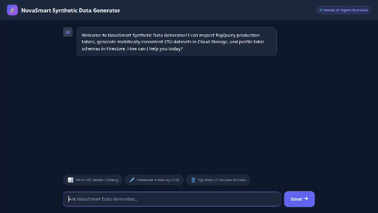

# NovaSmart Synthetic Data Generator Agent

An intelligent AI agent built with Google's Agent Development Kit (ADK) that profiles production BigQuery database schemas, calculates statistical distributions, generates fake datasets, and renders UI cards via A2UI.



---

## Capabilities & Implemented Tools

Based on the agent implementation in `app/agent.py`, the following tools and Google Cloud services are active:

### 1. Production Database Profiling (BigQuery)
- **`query_bigquery_dataset_catalog()`**: Lists datasets and available tables across production BigQuery catalogs.
- **`check_bigquery_table(table_name, dataset_id)`**: Inspects BigQuery tables to extract column schemas, data types, and sample rows.

### 2. External Seed Data Retrieval (Public API)
- **`fetch_synthetic_person_data(count)`**: Queries the public RandomUser API to fetch realistic user profiles (names, emails, locations) for seed data grounding. Reads API keys dynamically from environment variables.

### 3. Code Execution Sandbox (Vertex AI Agent Engine)
- **`execute_python_in_sandbox(code)`**: Runs Python calculations using `AgentEngineSandboxCodeExecutor` on Vertex AI Agent Engine for statistical sampling and data array manipulation.

### 4. Dataset Storage & Metadata Persistence (Cloud Storage & Firestore)
- **`upload_synthetic_dataset_to_gcs(table_name, csv_content)`**: Stores generated synthetic CSV files in Google Cloud Storage (`synthetic-data-generator-datasets-qwiklabs-gcp-03-bffdb63e0ac7`).
- **`save_table_profile(...)` & `get_table_profile(table_name)`**: Saves and retrieves table profile metadata documents in Google Cloud Firestore (`table_profiles` collection).

### 5. Omni Model Video Visualization (Vertex AI)
- **`generate_item_visualization_video(item_name, prompt_description)`**: Calls Google's Omni model (`gemini-omni-flash-preview` in location `global`) to generate short animated visualization videos of database records, saves them as ADK artifacts with `tool_context.save_artifact`, and uploads raw bytes to Cloud Storage.

### 6. Long-Term Memory (Vertex AI Memory Bank)
- **`PreloadMemoryTool` & `generate_memories_callback`**: Persists session facts across user conversations using Vertex AI Memory Bank.

### 7. Rich UI Rendering (A2UI v0.8)
- **A2UI Card Integration**: Formats schema summaries and dataset cards using `A2uiSchemaManager` (version 0.8) and `BasicCatalog`.

---

## Planned / Not Yet Implemented Features

The following features from the initial project brief are planned for future releases:
- **Vertex AI RAG Engine Corpus Integration** (*Planned, not yet implemented*)
- **Imagen 3 Static Schema Diagram Generation** (*Planned, not yet implemented*)

---

## Local Development & Setup Instructions

### Prerequisites
- Python 3.11+
- `uv` package manager (`pip install uv`)
- Google Cloud SDK (`gcloud`) with active GCP project authentication

### 1. Environment Setup

Clone the repository and install dependencies:
```bash
git clone <repository_url>
cd synthetic-data-generator
uv sync
```

Set environment variables:
```bash
export GOOGLE_CLOUD_PROJECT="qwiklabs-gcp-03-bffdb63e0ac7"
export RANDOMUSER_API_KEY="" # Optional API key for RandomUser API
```

### 2. Run Agent Backend Locally

To test the ADK agent backend locally:
```bash
uv run python -c "from app.agent import root_agent; print(root_agent)"
```

### 3. Run FastAPI Chat UI Locally

Navigate to the `frontend/` directory and set the target agent engine resource and directory:
```bash
cd frontend
export AGENT_ENGINE_RESOURCE_NAME="projects/971625608398/locations/us-east1/reasoningEngines/6520836227455778816"
export AGENT_DIRECTORY="app"
uv run python main.py
```

Open a browser and navigate to port 8080 on your local machine to interact with the chat UI.
